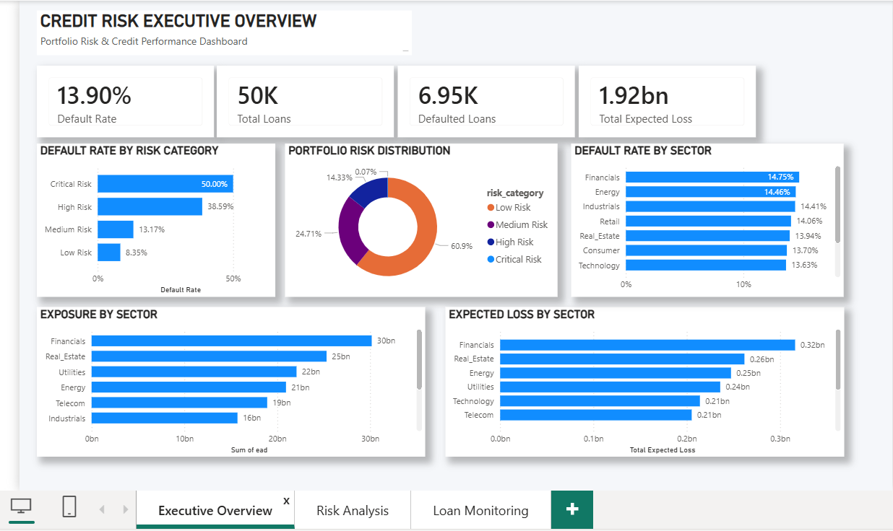
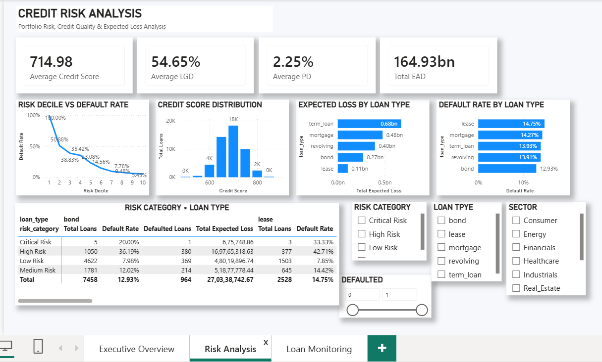
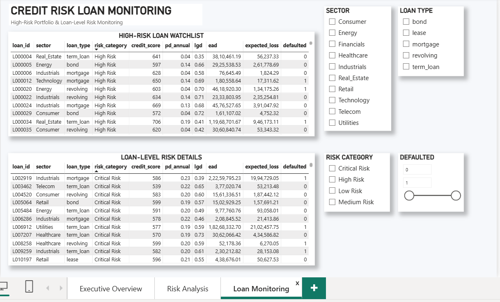

# Credit Risk Analytics & Monitoring Dashboard

A comprehensive **Credit Risk Analytics and Loan Monitoring Dashboard** built using **Power BI and SQL** to analyze loan portfolio risk, default behavior, expected losses, and high-risk loans.

The dashboard provides an executive-level overview as well as detailed credit risk and loan-level monitoring views.

---

## 📊 Project Overview

This project analyzes a portfolio of approximately **50K loans** across multiple sectors and loan types.

The dashboard helps identify:

- Overall portfolio default risk
- High-risk and critical-risk loans
- Credit score distribution
- Default rates across risk categories
- Default rates across loan types and sectors
- Exposure by sector
- Expected credit losses
- Loan-level risk details
- Defaulted and high-risk loans for monitoring

---

## 🛠️ Tools & Technologies

- **Power BI** – Dashboard development and data visualization
- **SQL** – Data analysis and risk calculations
- **CSV** – Source loan portfolio dataset
- **GitHub** – Project documentation and version control

---

# 📈 Dashboard Pages

## 1. Executive Overview

The Executive Overview provides a high-level view of the credit portfolio and its overall risk performance.

### Key KPIs

- **Default Rate:** 13.90%
- **Total Loans:** 50K
- **Defaulted Loans:** 6.95K
- **Total Expected Loss:** 1.92bn

### Visualizations

- Default Rate by Risk Category
- Portfolio Risk Distribution
- Default Rate by Sector
- Exposure by Sector
- Expected Loss by Sector

### Dashboard Preview



---

## 2. Credit Risk Analysis

The Risk Analysis page provides deeper insights into credit quality, probability of default, loss given default, exposure at default, and loan-level risk patterns.

### Key KPIs

- **Average Credit Score:** 714.98
- **Average LGD:** 54.65%
- **Average PD:** 2.25%
- **Total EAD:** 164.93bn

### Visualizations

- Risk Decile vs Default Rate
- Credit Score Distribution
- Expected Loss by Loan Type
- Default Rate by Loan Type
- Risk Category × Loan Type analysis
- Risk Category filters
- Loan Type filters
- Sector filters
- Defaulted loan filter

### Dashboard Preview



---

## 3. Loan Monitoring

The Loan Monitoring page focuses on identifying and monitoring high-risk and critical-risk loans at the individual loan level.

### Key Features

- High-Risk Loan Watchlist
- Loan-Level Risk Details
- Loan ID tracking
- Sector classification
- Loan type classification
- Risk category
- Credit score
- Annual Probability of Default (PD)
- Loss Given Default (LGD)
- Exposure at Default (EAD)
- Expected Loss
- Default status

Interactive filters allow users to analyze loans by:

- Sector
- Loan Type
- Risk Category
- Default Status

### Dashboard Preview



---

# 🔍 Key Risk Insights

The analysis highlights several important portfolio risk patterns:

### Risk Category

Critical and high-risk loans show substantially higher default rates compared with low-risk loans.

### Risk Deciles

Default rates decrease significantly as risk decile increases, indicating a strong relationship between portfolio risk segmentation and observed defaults.

### Loan Type

Loan types exhibit different default rates and expected-loss profiles, allowing comparison of credit risk across lending products.

### Sector Risk

Default rates and portfolio exposure vary across sectors, helping identify sectors that require closer risk monitoring.

### Expected Loss

Expected loss analysis helps identify loan types and sectors contributing the most to potential portfolio losses.

---

# 🧮 SQL Analysis

SQL was used to perform portfolio-level and loan-level credit risk analysis.

The SQL analysis includes:

- Loan portfolio analysis
- Default rate calculations
- Risk category classification
- Loan type analysis
- Sector-level analysis
- Expected loss calculations
- Credit risk segmentation
- High-risk loan identification
- Defaulted loan analysis

SQL scripts are available in:

```text
SQL/credit_risk_analysis.sql
